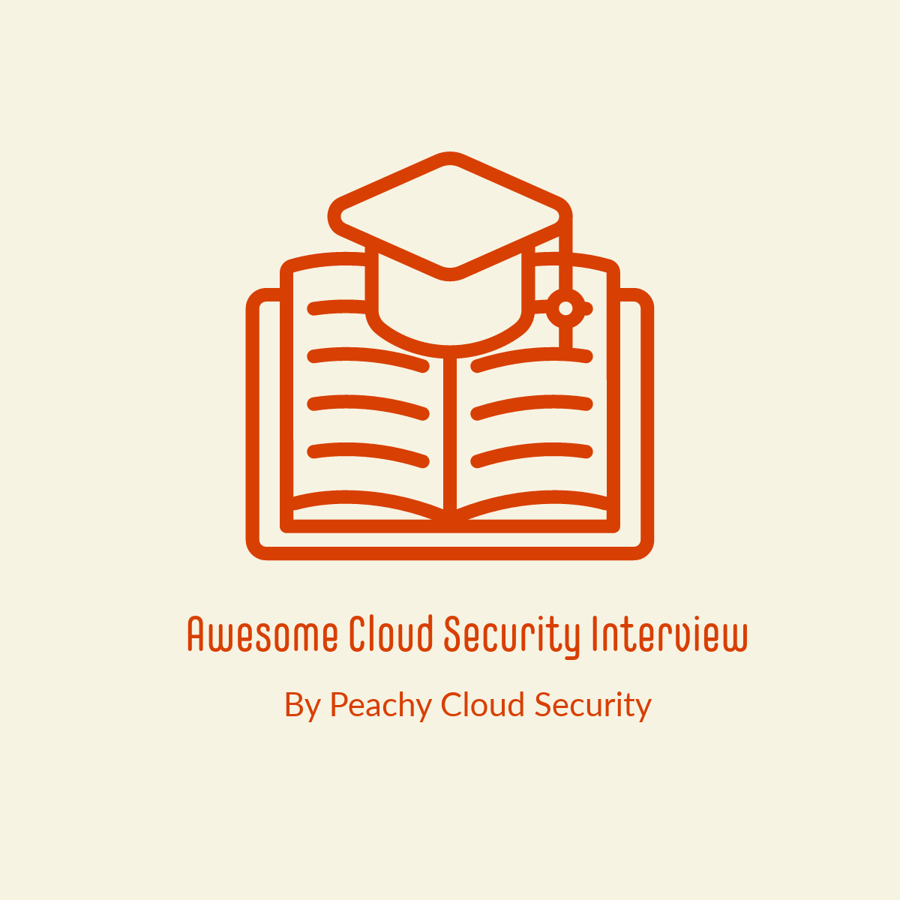

# Awesome Cloud Security Interview Questions :+1:

## General Cloud Security Knowledge

### Basic
- What are the core principles of cloud security?
- Explain the shared responsibility model in cloud security.
- What is the principle of least privilege, and why is it important in cloud security?
- How do you ensure data encryption in transit and at rest in a cloud environment?
- Describe the importance of identity and access management in cloud security.
- What is a security group in AWS, and how does it differ from a network ACL?
- How can you secure data stored in cloud storage buckets like S3 or Blob Storage?
- Explain the concept of data classification and how it's used in cloud security.
- What are some common threats to cloud environments, and how can they be mitigated?
- What is the significance of a Virtual Private Cloud (VPC) in AWS?
- What are some common cloud misconfigurations that can lead to security vulnerabilities, and how can they be prevented?
- Describe a scenario where a misconfigured IAM policy resulted in a data breach. How would you identify and rectify such misconfigurations?
- How do you ensure that security groups and network ACLs in AWS are correctly configured to prevent unintended exposure of resources?
- What is AWS Identity and Access Management (IAM) Access Analyzer, and how can it help identify and fix misconfigurations in access policies?
- Should you expose Database access publicly or to a web application directly?

### Advance Scenario Based Questions
- Can you describe the process of designing a Cloud Security Standard for scanning and ensuring its consistent application across AWS environments?
- How would you define security baselines and metrics for auditing and threat modeling in a cloud environment, and what benefits does this bring to an organization?
- Walk me through the process of setting up automated backups for your cloud-based databases while ensuring their security.
- Explain how you would implement Zero Trust Architecture in a hybrid cloud environment that includes AWS and Azure.
- Your company is migrating to the cloud. How would you ensure a secure transition, including data migration and application security?
- Describe a scenario where you had to respond to a critical security incident in your cloud environment. What steps did you take to contain and mitigate the incident?
- How would you use Infrastructure as Code (IaC) tools like Terraform to automate security controls and ensure consistent security across cloud resources?
- What is an SBOM (Software Bill of Materials), and why is it important in cloud security?
- How can you generate and maintain an SBOM for the software components used in your cloud applications?
- Describe the role of SBOMs in vulnerability management and supply chain security.
- What challenges may arise when implementing SBOMs in a multi-cloud environment, and how can they be addressed?
- Explain how SBOMs can be used to track and mitigate security vulnerabilities in containerized applications.
- How do you approach vulnerability management at scale in a cloud environment with numerous resources?
- Describe the steps involved in conducting automated vulnerability scanning of cloud resources.
- What is the role of asset discovery in effective vulnerability management, and how can it be automated?
- How do you prioritize and remediate vulnerabilities based on their severity and impact in a large-scale cloud environment?
- Explain the importance of continuous monitoring and re-assessment in vulnerability management at scale.

### Compliance:
- How can automation be used to enforce security policies and compliance in a cloud environment?
- Describe how you would automate the patching and updating of cloud resources to address security vulnerabilities.
- What is Infrastructure as Code (IaC), and how does it improve cloud security?
- How do you ensure compliance with industry standards like PCI DSS or ISO 27001 in a cloud environment?
- Explain the benefits of continuous security monitoring and how it can be achieved in the cloud.
- How would you use cloud-native security services to automate threat detection and response?
- Describe a scenario where you implemented automated incident response in a cloud environment.
- What are the key components of a cloud security posture management (CSPM) system, and how would you use it to maintain security?
- Explain the concept of a Security Information and Event Management (SIEM) system and its role in cloud security.

    

## AWS-Specific Questions

### Attack & Defense
- How do you secure an AWS EC2 instance?
- What is AWS Identity and Access Management (IAM), and how does it work?
- How can you protect against DDoS attacks in AWS?
- What is AWS GuardDuty, and how does it help in security?
- Explain the purpose of AWS CloudTrail and CloudWatch in security monitoring.
- What is AWS Key Management Service (KMS), and how does it handle encryption keys?
- Describe AWS Security Groups and Network ACLs. How do they differ?
- How do you implement security best practices for AWS Lambda functions?
- What is the AWS Well-Architected Framework, and why is it important for security?
- How do you securely manage secrets and credentials in AWS?
- How do you enforce HTTPS (TLS v1.2 and TLSv1.3) on all external applications in a cloud environment, and why is this important for security?
- How can you protect against data exfiltration in a cloud environment?
- What is a privilege escalation attack, and how do you prevent it in a cloud environment?
- Explain the importance of web application firewalls (WAFs) in cloud security.
- How can you detect and respond to insider threats in a cloud environment?
- Describe a scenario where a misconfigured IAM policy in AWS posed a security risk. How would you identify and rectify such misconfigurations?
- What is a Distributed Denial-of-Service (DDoS) attack, and how can cloud providers help mitigate it?
- How do you ensure the security of data transferred between on-premises infrastructure and the cloud?
- Imagine you are responsible for reviewing the security of AWS Lambda functions in your organization's environment. You discover a Lambda function that has an SSRF (Server-Side Request Forgery) vulnerability, and specifically at "http://127.0.0.1:9001/2018-06-01/runtime/invocation/next." Explain the potential security risks associated with this SSRF vulnerability and how you would recommend mitigating these risks.
- Have you worked on AWS WAF/Azure/GCP Cloud Armor. How will you test & implement core rule set in production. Provide the strategy. 
- Explain AWS S3 buckets ransomware attacks, and what best practices would you recommend?
- Describe the steps you would take to detect and respond to a ransomware attack on an S3 bucket in real-time.
- How cloud ransomware uses KMS to encrypt objects within Amazon S3 buckets of a compromised AWS account.
- Explain how you would implement versioning and lifecycle policies to prevent data loss in the event of a ransomware attack on S3.
- Your organization needs to implement multi-cloud security. What strategies and tools would you use to ensure consistent security across AWS, GCP, and Azure?
- Describe a scenario where a misconfigured security group in AWS led to a security breach. How would you prevent such misconfigurations in the future?
- What is AWS segmentation, and why is it important for securing cloud environments?
- Explain the concept of VPC peering in AWS. How can it be used to implement network segmentation?
- How do you configure security groups and network ACLs to enforce network segmentation within an AWS VPC?
- Describe the benefits and use cases of using AWS Transit Gateway for network segmentation.
- What are the key considerations when implementing cross-account access controls for AWS resources in a segmented environment?
- What is the purpose of the IAM PassRole permission, and how is it used in AWS?
- Explain the potential security risks associated with granting the PassRole permission to IAM roles.
- How do you restrict the usage of the PassRole permission to specific roles and resources while ensuring security?
- Describe a scenario where you would use the PassRole permission in AWS IAM, and how would you ensure its security?
- What best practices would you follow when managing IAM roles with PassRole permissions in a AWS environment?
- What is the AWS CIS (Center for Internet Security) Benchmark, and why is it important for securing AWS resources?
- Describe some key security checks included in the AWS CIS Benchmark for AWS Identity and Access Management (IAM).
- How do you use AWS Config to check compliance with the AWS CIS Benchmark, and what actions would you take if non-compliance is detected?
- Explain the importance of enabling AWS CloudTrail and AWS Config to align with the CIS Benchmark requirements.
- How would you address vulnerabilities identified by AWS Inspector that are related to the AWS CIS Benchmark?
- CloudTrail vs. CloudWatch and explain in-depth from a security perspective.
- Why is IMDSv1 vulnerable to SSRF, and can you explain it?
- Have you implemented IMDSv2, and how does it fix SSRF?
- What is the Instance Metadata Service (IMDS 169.254.169.254) in AWS, and why is it a potential security concern for EC2 instances? Explain how attackers can abuse the IMDS to compromise an EC2 instance's security.
- Describe the security implications of IAM credentials stored in the Instance Metadata Service (IMDS) for EC2 instances. How can organizations protect against unauthorized access to IAM credentials via the IMDS, and what best practices should be followed to mitigate this risk?
- When should you use TGW (Transit Gateway), and is there any security improvement for using this?
- Why security group named "default" with ports 22, 25, 53, 80, 443, 8080, 6443, 3679, 3306, 9001 is an issue?
- Can you explain how to use and when to use Access Key ID and Principal ID with one example?
- Explain the given IAM policy and its purpose.
- Explain the given policy and identify any issues with it.
- What comes to your mind when a service needs cross-account access?
- What security needs be taken care when giving cross acount access & what is confused deputy in IAM?
- Do you agree that we need to enable data encryption at rest by default?
- What checks do you perform in IAM to ensure a Lambda function triggered by an event works correctly?

### Detection & Monitoring
-  What steps would you take to develop or enhance real-time alerting and detection mechanisms for critical cloud resources like EC2, IAM, S3, VPC, and Security Groups?
-  How can you enable comprehensive logging for EC2, IAM, S3, VPC, and Security Group activities in AWS to improve detection and monitoring capabilities?
-  How do you configure AWS CloudTrail and Amazon S3 Event Notifications to monitor and respond to changes in S3 bucket permissions to prevent unauthorized access?
- Imagine you detect suspicious activity in your AWS environment. Walk me through the steps you would take to investigate and respond to the incident.
-  Explain how you would use AWS Config to detect and remediate cloud misconfigurations automatically.
-  How can you automate the detection and remediation of misconfigured security groups in AWS?
-  How to integrate AWS guardduty with Slack for real time detection.
-  Have you worked on GuardDuty, and do you have any suggestions to reduce false positives?
-  How to create a lambda function for config rules and sending email using SES, with multi-account aggregator data.
-  How do you ensure data integrity for CloudTrail logs?
- How do you get unencrypted EBS volumes easily using Config filters?
- How do you use CloudWatch metrics filters?
- How do you manage EC2 vulnerability patching in an automated way?
- What checks does AWS Inspector perform to identify instance vulnerabilities?
- When is encryption by default not enough?
- Would you suggest key rotation, and what should be the rotation period?

## GCP-Specific Questions
- What is Google Cloud Identity and Access Management (IAM)?
- Explain the role of Google Cloud Security Command Center in GCP.
- How can you secure Google Kubernetes Engine (GKE) clusters?
- Describe how Google Cloud Armor helps protect applications running on GCP.
- What are Google Cloud Key Management Service (KMS) and Cloud HSM?
- How does Google Cloud Logging and Monitoring assist in security?
- How do you enable VPC Service Controls in GCP, and why is it important?
- Explain the concept of Identity-Aware Proxy (IAP) in GCP.
- What is the purpose of Google Cloud Security Scanner?
- How can you secure data stored in Google Cloud Storage?
- You're responsible for securing a GCP Kubernetes cluster. What measures would you put in place to ensure its security?

## Azure-Specific Questions
- What is Azure Active Directory (Azure AD), and how does it relate to cloud security?
- How do you secure Azure Virtual Machines (VMs)?
- Explain Azure Security Center and its key features.
- How does Azure DDoS Protection mitigate distributed denial-of-service attacks?
- What is Azure Key Vault, and how does it manage cryptographic keys?
- Describe the Azure Monitor and Azure Sentinel services in security monitoring.
- How do you implement network security groups (NSGs) in Azure?
- What are the security implications of Azure Functions, and how can they be addressed?
- How can you secure Azure Blob Storage and Azure SQL Database?
- What is Azure Bastion, and how does it enhance security in Azure?
- An Azure VM is showing signs of compromise. How would you isolate the VM, investigate the issue, and remediate it?

## Cloud (CSP) Managed Kubernetes

#### Types of Pod Creation:
- In Kubernetes, what are the different methods for creating pods, and when would you use each method?
- Describe the differences between Imperative and Declarative pod creation in Kubernetes.
- How do you ensure that security configurations and policies are consistently applied regardless of the method used for pod creation?
- What role does container image scanning play in securing pods created in a Kubernetes cluster?
- Walk me through the process of creating a pod using Kubernetes YAML manifests and explain how you would apply security best practices.

## DevSecOps Pipeline :
- What is a DevSecOps pipeline bypass, and how can it occur in a CI/CD environment?
- Describe the techniques and tools that attackers might use to bypass security controls in a DevSecOps pipeline.
- How do you ensure the integrity and security of the CI/CD pipeline to prevent bypass attempts?
- What strategies can you implement to detect and respond to DevSecOps pipeline bypass attempts effectively?
- Explain how you would conduct a security assessment of a DevSecOps pipeline to identify potential vulnerabilities.

## Reference :pray:

- Additional reference: https://github.com/jassics/security-interview-questions/blob/main/aws-security-interview-questions.md

Note: Chatgpt has been used to modify & reframe the questions, I have faced/asked in reallife.
